# 15-cloud-services

## 15.1 Ораганизация сети

Доступ в инетрнет с ВМ из Public сети

Подключение из public ВМ к Ptivate ВМ

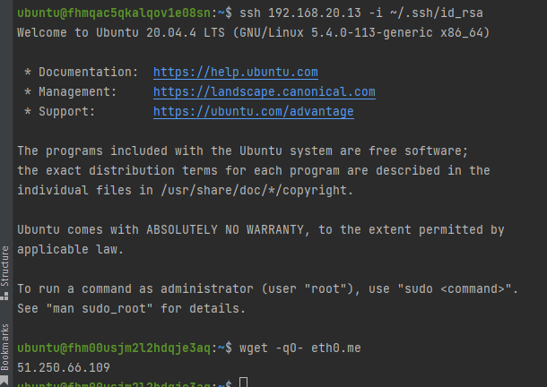

Доступ в инетрнет с ВМ из private сети

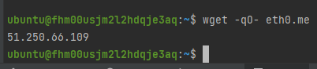

Список ВМ

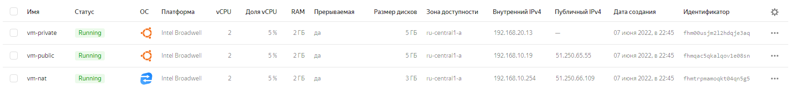

Создаваемый VPC завис на Creating

## 15.2 Вычислительные мощности. Балансировщики нагрузки

Сетевой балансировщик

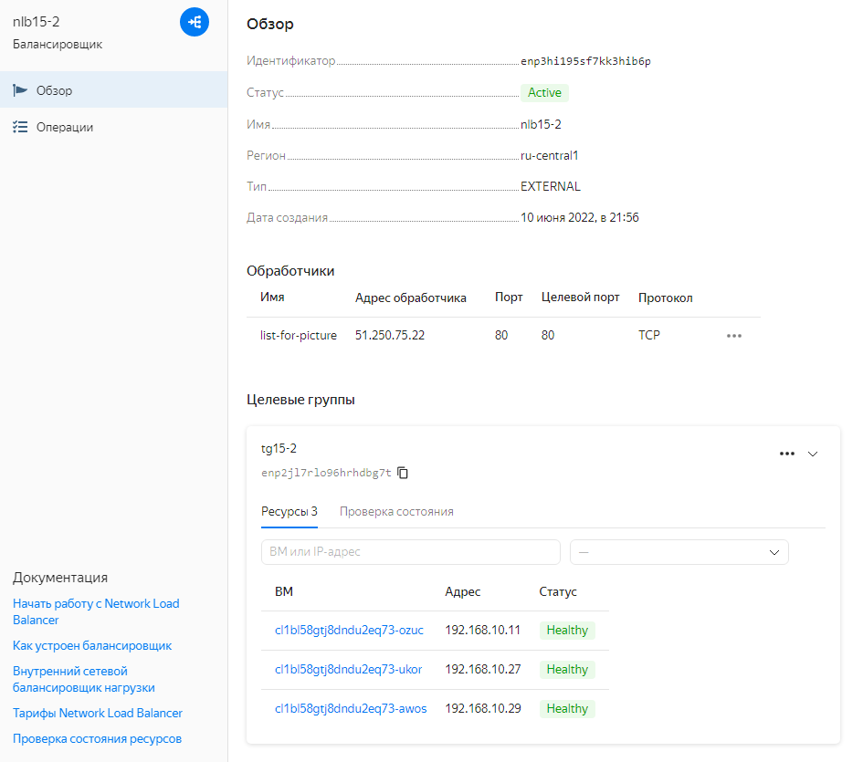

Открываемая страница

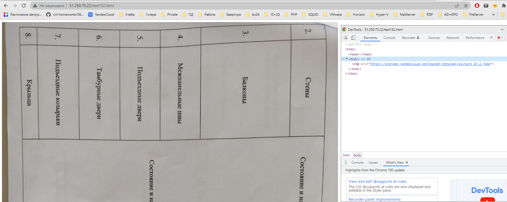

Группа ВМ

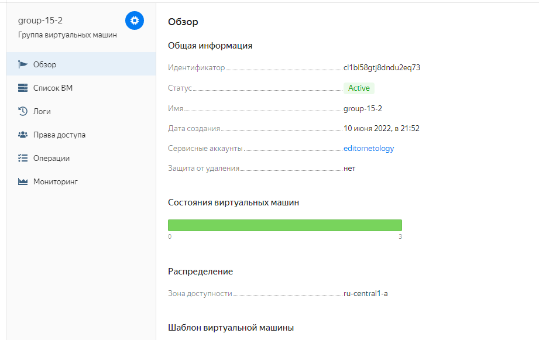

Сетевой балансировщик после остановки ВМ

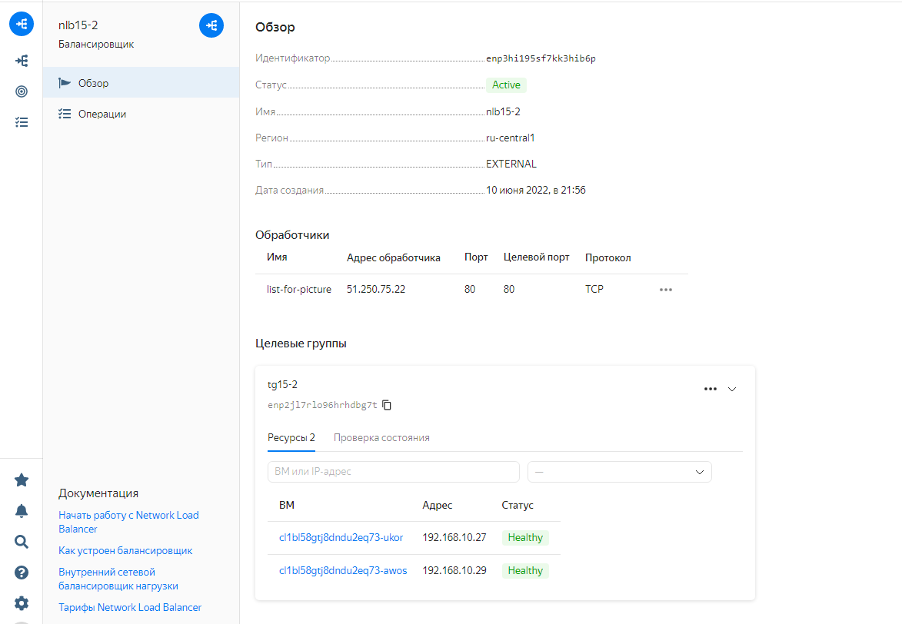

Сетевой балансировщик после удаления ВМ

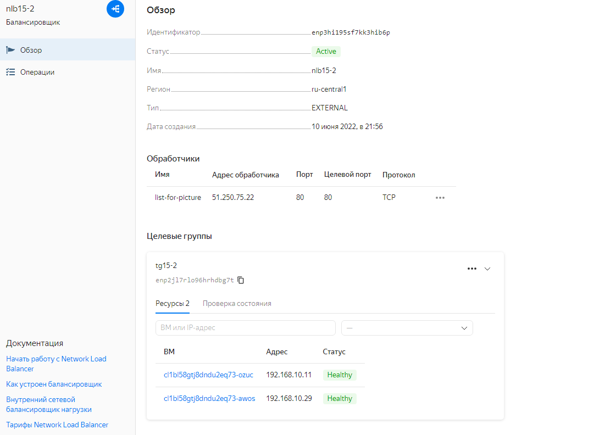

## 15.4  Кластеры и ресурсы под управлением облачных провайдеров

Кластер mysql

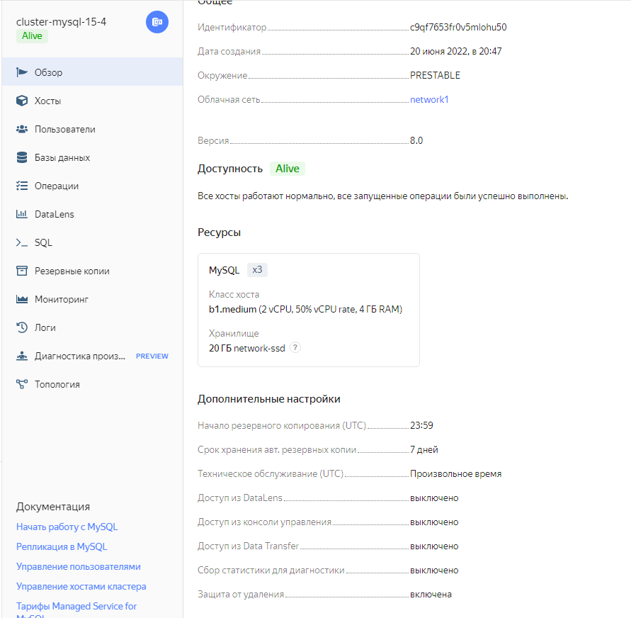

Хосты кластера

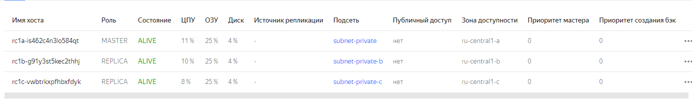

База данных

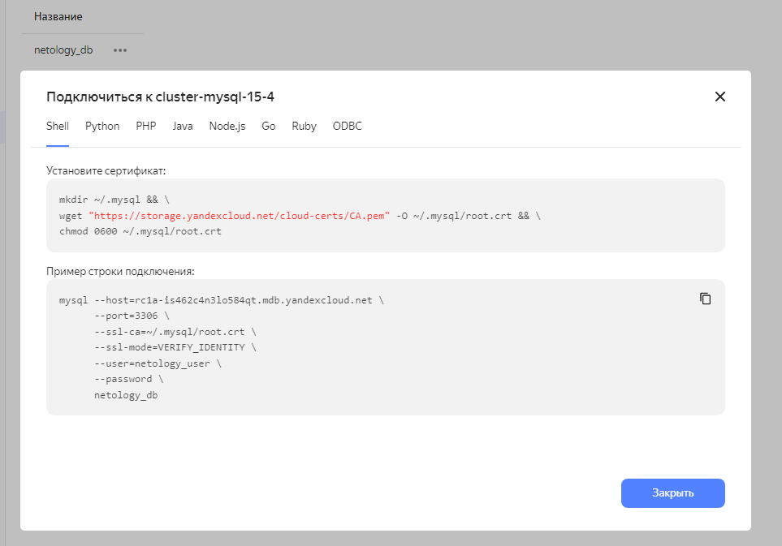

Результат создания кластера kubernetes

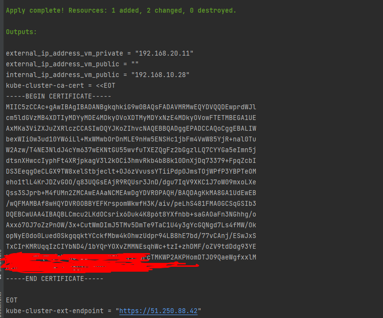

Группа узлов

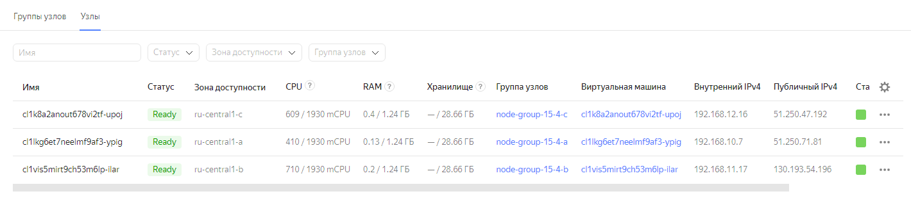

Подключение через kubectl

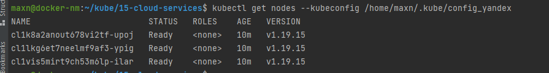

Развёрнутый phpmyadmin

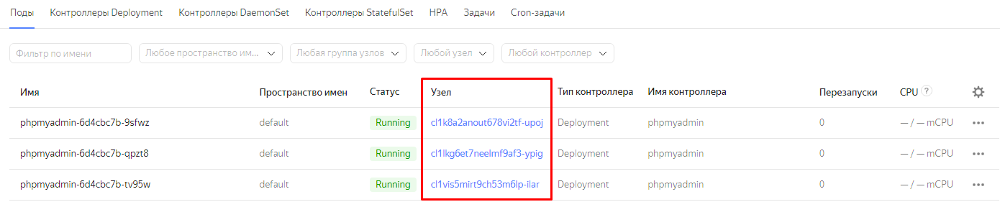

Loadbalancer

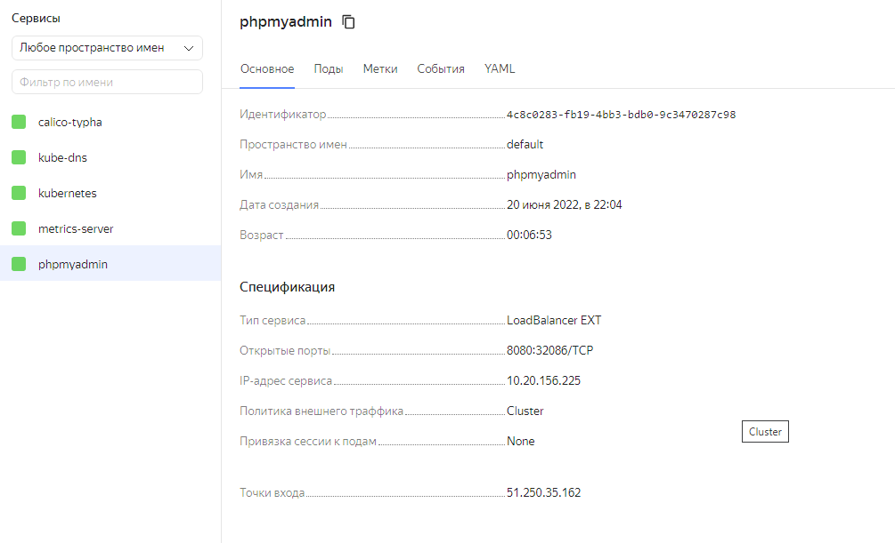

Подключение к базе через phpmyadmin

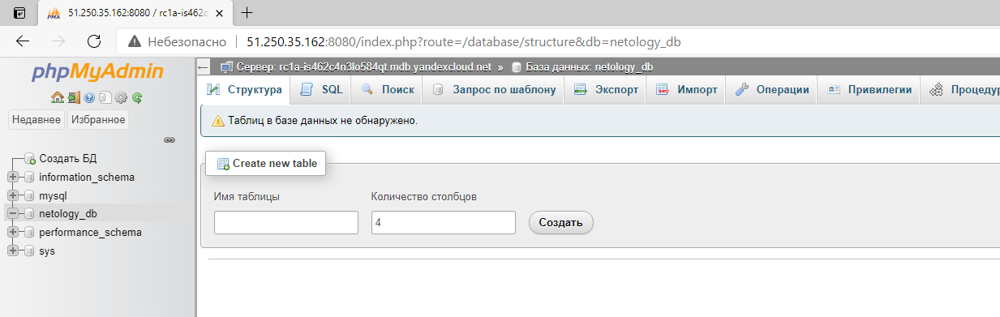

