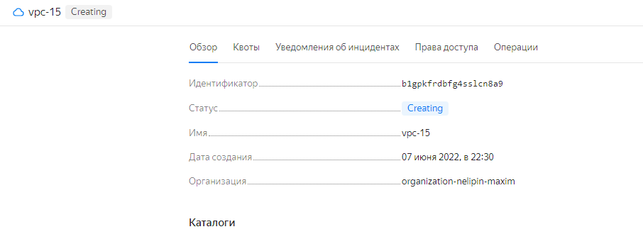

# 15-cloud-services

## 15.1 Ораганизация сети

Доступ в инетрнет с ВМ из Public сети

Подключение из public ВМ к Ptivate ВМ

Доступ в инетрнет с ВМ из private сети

Список ВМ

Создаваемый VPC завис на Creating

## 15.2 Вычислительные мощности. Балансировщики нагрузки

Сетевой балансировщик

Открываемая страница

Группа ВМ

Сетевой балансировщик после остановки ВМ

Сетевой балансировщик после удаления ВМ

